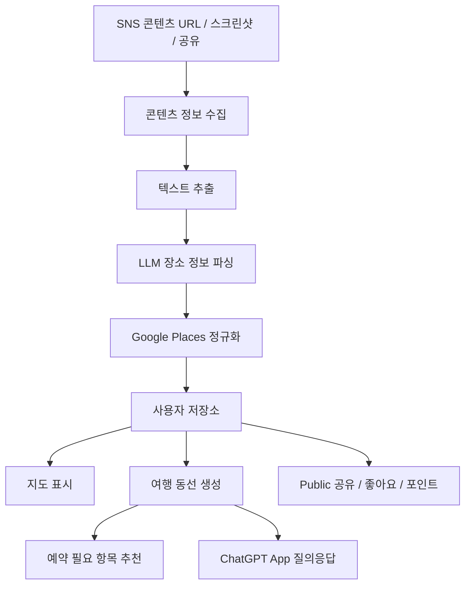
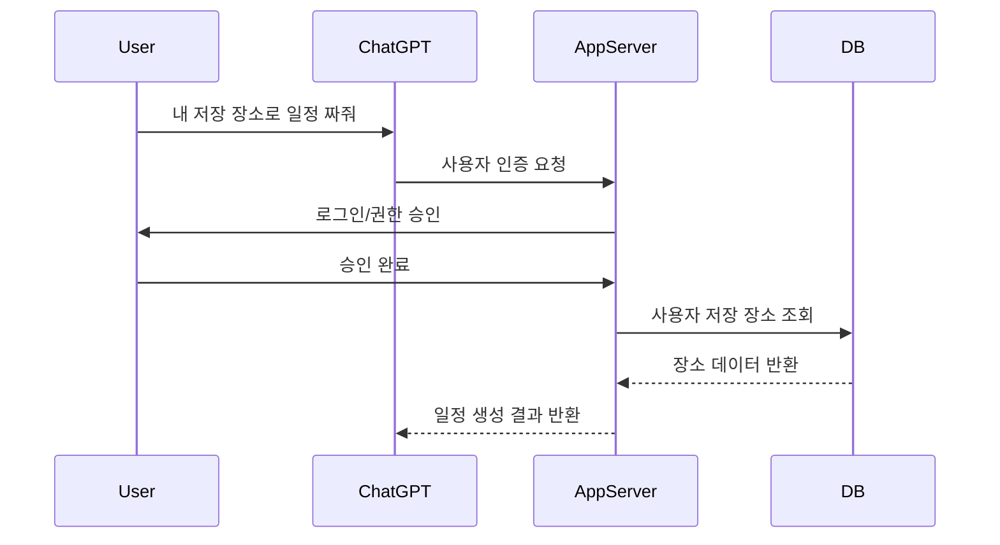

# TravelClip Planner 프로젝트 기획서

> SNS 여행 콘텐츠(YouTube Shorts, YouTube 영상, Instagram Reels 등)에 나온 장소 정보를 자동으로 추출하고, Google Maps 기반으로 저장·정규화한 뒤, 사용자의 여행 동선과 예약 추천까지 생성하는 서비스

---

## 1. 프로젝트 목적

사용자는 여행 정보를 얻기 위해 Instagram Reels, YouTube Shorts, YouTube 영상, 블로그 등을 반복적으로 소비한다.  
하지만 실제 여행 계획을 세우려면 다음 작업을 직접 해야 한다.

- 영상 속 장소명 확인
- 장소를 Google Maps에서 검색
- 저장 리스트에 추가
- 위치별로 동선 정리
- 예약이 필요한 교통권/입장권/투어 확인
- 일정표로 재구성

본 프로젝트는 이 과정을 자동화한다.

### 핵심 가치

**SNS 여행 콘텐츠를 실제 여행 계획으로 바꿔주는 서비스**

---

## 2. 핵심 문제

### 사용자 Pain Point

1. 릴스/쇼츠를 보며 가고 싶은 곳을 저장하지만 나중에 다시 찾기 어렵다.
2. 영상에 나온 장소명이 정확히 무엇인지 모르는 경우가 많다.
3. Google Maps에 하나씩 검색하고 저장하는 과정이 귀찮다.
4. 저장한 장소들이 실제로 하루 동선으로 가능한지 판단하기 어렵다.
5. 교통권, 입장권, 액티비티 예약 필요 여부를 따로 확인해야 한다.
6. 여러 콘텐츠에서 나온 장소를 한 번에 비교하고 정리하기 어렵다.

---

## 3. 타깃 사용자

### 1차 타깃

- 일본, 동남아, 유럽 등 자유여행을 준비하는 20~40대
- Instagram Reels / YouTube Shorts로 여행지를 탐색하는 사용자
- Google Maps 저장 기능을 자주 사용하는 사용자
- 여행 계획을 세우는 데 시간을 많이 쓰는 사용자

### 2차 타깃

- 여행 인플루언서
- 여행 콘텐츠 큐레이터
- 여행 커뮤니티 운영자
- 여행사/액티비티 제휴 사업자

---

## 4. 제품 포지셔닝

### 한 줄 설명

> 릴스와 쇼츠 속 여행지를 자동으로 저장하고, 최적의 여행 코스로 바꿔주는 AI 여행 플래너

### 키워드

- SNS to Map
- Reel to Route
- Shorts to Itinerary
- AI Travel Planner
- Google Maps 기반 동선 최적화
- 여행 콘텐츠 구조화

---

## 5. 전체 서비스 구조



---

## 6. 핵심 기능

### 6.1 SNS 콘텐츠 저장

사용자가 여행 관련 영상 URL을 입력하거나 공유하면 해당 콘텐츠를 저장한다.

### 지원 대상

| 플랫폼 | 1차 지원 | 추후 지원 |
|---|---:|---:|
| YouTube 일반 영상 | O |  |
| YouTube Shorts | O |  |
| Instagram Reels | 부분 지원 | O |
| TikTok |  | O |
| 블로그/웹페이지 |  | O |

### 저장 방식

1. URL 붙여넣기
2. 모바일 공유 시트로 저장
3. 스크린샷 업로드
4. 추후: 크롬 확장 프로그램
5. 추후: Instagram DM Bot / Telegram Bot

---

### 6.2 텍스트 추출

영상에서 장소 정보를 얻기 위해 여러 텍스트 소스를 조합한다.

### YouTube 추출 소스

- 영상 제목
- 영상 설명
- 해시태그
- 챕터 정보
- 자막/트랜스크립트
- 화면 OCR
- 음성 인식 결과

### Instagram Reels 추출 소스

- 릴스 URL
- 작성자 정보
- 캡션
- 해시태그
- 썸네일/프레임 OCR
- 음성 인식 결과
- 사용자가 직접 입력한 보충 설명

### 추출 우선순위

1. 공식적으로 접근 가능한 텍스트
2. 사용자가 제공한 텍스트/스크린샷
3. OCR
4. 음성 인식
5. LLM 추론

---

### 6.3 장소 정보 파싱

LLM을 사용해 비정형 텍스트에서 장소 후보를 추출한다.

### 추출 대상

- 장소명
- 상호명
- 지역명
- 역명
- 카테고리
- 추천 이유
- 가격 정보
- 영업시간 힌트
- 예약 필요 여부
- 영상 내 언급 맥락
- 원천 콘텐츠 URL

### 장소 추출 JSON 예시

```json
{
  "source": {
    "platform": "youtube",
    "url": "https://youtube.com/shorts/xxxxx",
    "title": "도쿄에서 꼭 가야 할 돈카츠 맛집",
    "creator": "travel_creator"
  },
  "places": [
    {
      "raw_name": "마루고 돈카츠",
      "normalized_name": null,
      "category": "restaurant",
      "city": "Tokyo",
      "area": "Akihabara",
      "reason": "영상에서 도쿄 돈카츠 맛집으로 추천됨",
      "confidence": 0.78,
      "evidence_text": "아키하바라 근처 마루고 돈카츠는 꼭 가야 해요",
      "needs_reservation": false
    }
  ]
}
```

---

### 6.4 Google Maps 장소 정규화

추출된 장소 후보를 Google Places API로 실제 장소와 매칭한다.

### 저장 정보

- Google Place ID
- 장소명
- 주소
- 위도/경도
- 카테고리
- 평점
- 리뷰 수
- 영업시간
- Google Maps URL
- 국가/도시/지역
- place match confidence

### 정규화 기준

- 장소명 유사도
- 지역명 일치 여부
- 카테고리 일치 여부
- 주소/역명 근접도
- 리뷰 수/평점
- 원천 콘텐츠 문맥

### 검수 UX

정확도가 낮은 경우 사용자에게 다음 UI를 제공한다.

- “이 장소가 맞나요?”
- 후보 장소 3개 표시
- 직접 검색
- 장소 제외

---

### 6.5 여행 동선 생성

사용자가 저장한 장소를 기반으로 여행 일정을 생성한다.

### 입력값

- 여행 도시
- 여행 기간
- 숙소 위치
- 도착/출국 공항
- 선호 스타일
- 이동 수단
- 하루 시작/종료 시간
- 꼭 가고 싶은 장소
- 제외할 장소

### 동선 생성 기준

- 장소 간 거리
- 이동 시간
- 카테고리 균형
- 영업시간
- 예약 필요 여부
- 식사 시간
- 카페/휴식 배치
- 지역별 묶음
- 사용자의 우선순위

### 출력 예시

```json
{
  "trip": {
    "city": "Tokyo",
    "days": 3,
    "base_location": "Ueno Station"
  },
  "itinerary": [
    {
      "day": 1,
      "theme": "Ueno - Asakusa - Akihabara",
      "places": [
        {
          "order": 1,
          "name": "Senso-ji",
          "time": "10:00",
          "duration_minutes": 90,
          "move_from_previous": null
        },
        {
          "order": 2,
          "name": "Tonkatsu Marugo",
          "time": "12:30",
          "duration_minutes": 60,
          "move_from_previous": {
            "method": "train",
            "minutes": 22
          }
        }
      ]
    }
  ]
}
```

---

### 6.6 예약 필요 항목 추천

동선에 포함된 장소와 도시 정보를 기반으로 예약이 필요한 상품을 추천한다.

### 예시

도쿄 여행의 경우:

- 나리타 공항 → 도쿄 시내: Skyliner
- 하네다 공항 → 도쿄 시내: 모노레일/리무진버스
- 팀랩 보더리스/플래닛
- 시부야 스카이
- 도쿄 디즈니리조트
- 후지산 일일투어
- 교통패스
- 공항 픽업

### 추천 방식

- 사용자의 일정과 동선에 실제로 필요한 경우만 추천
- 일정 카드 안에 과도하게 광고처럼 넣지 않음
- “예약하면 좋은 이유”를 설명
- Klook, Booking.com 등 제휴 링크 연결

### 예약 추천 카드 예시

```json
{
  "type": "booking_recommendation",
  "city": "Tokyo",
  "item": "Keisei Skyliner Ticket",
  "reason": "나리타 공항 도착 후 우에노 숙소로 이동하는 일정이므로 Skyliner가 가장 빠릅니다.",
  "recommended_timing": "입국일",
  "affiliate_provider": "klook",
  "booking_url": "https://..."
}
```

---

### 6.7 Public 동선 공유

사용자는 자신이 만든 여행 동선이나 장소 리스트를 공개할 수 있다.

### 공개 가능한 단위

- 장소 리스트
- 1일 코스
- 전체 여행 일정
- 테마별 컬렉션
- 영상 기반 추천 리스트

### 공개 설정

- Private
- Link only
- Public

### Public 페이지 구성

- 제목
- 도시
- 여행 기간
- 추천 대상
- 지도
- 장소 리스트
- 일정표
- 원천 영상 링크
- 좋아요 수
- 저장 수
- 복제 수
- 예약 링크

---

### 6.8 좋아요 / 저장 / 포인트

사용자가 공개된 동선이나 장소 추천을 좋아요/저장/복제하면 원 작성자에게 포인트를 부여한다.

### 포인트 적립 기준 예시

| 액션 | 포인트 |
|---|---:|
| 좋아요 | 1 |
| 저장 | 3 |
| 일정 복제 | 5 |
| 예약 전환 발생 | 20 |
| 신고로 삭제됨 | -50 |

### 포인트 사용처 후보

- AI 일정 재생성 추가 횟수
- 프리미엄 동선 템플릿 열람
- 지도 PDF Export
- 동행자 협업 기능
- 인기 코스 상단 노출
- 제휴 쿠폰 교환
- 배지/랭킹 시스템

### 주의사항

초기에는 현금성 보상보다 서비스 내 기능 unlock 방식이 안전하다.

---

### 6.9 원천 콘텐츠 표시

장소와 동선을 추천할 때 해당 정보가 어떤 영상/쇼츠/릴스에서 추출되었는지 함께 표시한다.

### 표시 이유

- 사용자 신뢰 확보
- AI 추천 근거 제공
- 장소 오매칭 검수 가능
- 창작자 출처 투명성
- 원본 콘텐츠 재방문 유도

### UI 예시

장소 카드에 다음 정보를 표시한다.

- 원천 플랫폼
- 영상 제목
- 크리에이터명
- 원본 링크
- 추출 문장
- 신뢰도
- “이 장소 맞음 / 틀림” 피드백

---

## 7. ChatGPT App 역할

ChatGPT App은 핵심 저장 채널이 아니라, 저장된 데이터를 대화형으로 활용하는 채널로 설계한다.

### ChatGPT App에서 제공할 기능

1. 내 저장 장소 불러오기
2. 특정 도시 저장 장소 요약
3. 저장 장소 기반 일정 생성
4. 일정 수정 요청
5. 예약 필요 항목 추천
6. Public 동선 검색
7. 내 포인트/좋아요 현황 조회
8. 원천 영상 기반 질의응답

### 사용자 질문 예시

- “내가 저장한 도쿄 장소로 3박 4일 일정 짜줘”
- “비 오는 날 버전으로 바꿔줘”
- “부모님이랑 가기 좋은 장소만 남겨줘”
- “예약해야 하는 것들만 따로 알려줘”
- “이 동선에서 너무 멀리 떨어진 곳 빼줘”
- “내가 저장한 오사카 맛집만 정리해줘”
- “다른 사람들이 많이 저장한 도쿄 2일 코스 추천해줘”

---

## 8. 인증/로그인 구조

### 기본 원칙

사용자 데이터는 서비스 자체 DB에 저장한다.  
ChatGPT App은 OAuth를 통해 서비스 계정과 연결한다.

### 필요 기능

- 자체 회원가입/로그인
- OAuth 연동
- ChatGPT App 계정 연결
- 사용자별 저장 장소 조회
- 사용자별 일정 조회
- 포인트/좋아요 조회

### 인증 흐름



---

## 9. 추천 기술 스택

### 9.1 MVP 웹 서비스

### Frontend

- Next.js
- React
- Tailwind CSS
- shadcn/ui
- Google Maps JavaScript API

### Backend

- Next.js API Routes 또는 FastAPI
- Supabase
- PostgreSQL
- pgvector optional
- Redis optional

### AI / Parsing

- OpenAI API
- Whisper 또는 STT API
- OCR API
- LLM structured output

### 지도/장소

- Google Places API
- Google Maps Embed / JavaScript API
- Directions API

### 인증

- Supabase Auth
- OAuth
- Google Login

### 배포

- Vercel
- Supabase
- Cloudflare Workers optional

---

### 9.2 ChatGPT App

- OpenAI Apps SDK
- MCP Server
- OAuth 2.1
- React UI Component
- Tool descriptors
- Resource templates

---

## 10. 데이터베이스 스키마 초안

### 10.1 users

| 컬럼 | 타입 | 설명 |
|---|---|---|
| id | uuid | 사용자 ID |
| email | text | 이메일 |
| name | text | 이름 |
| avatar_url | text | 프로필 |
| created_at | timestamp | 가입일 |

### 10.2 sources

| 컬럼 | 타입 | 설명 |
|---|---|---|
| id | uuid | 원천 콘텐츠 ID |
| user_id | uuid | 저장한 사용자 |
| platform | text | youtube/instagram/tiktok |
| url | text | 원본 URL |
| title | text | 제목 |
| creator | text | 작성자 |
| thumbnail_url | text | 썸네일 |
| raw_text | text | 추출된 전체 텍스트 |
| status | text | pending/parsed/failed |
| created_at | timestamp | 저장일 |

### 10.3 extracted_places

| 컬럼 | 타입 | 설명 |
|---|---|---|
| id | uuid | 추출 장소 후보 ID |
| source_id | uuid | 원천 콘텐츠 |
| raw_name | text | 추출된 장소명 |
| category | text | 카테고리 |
| city_hint | text | 도시 힌트 |
| area_hint | text | 지역 힌트 |
| evidence_text | text | 추출 근거 |
| confidence | numeric | 추출 신뢰도 |
| status | text | pending/matched/rejected |

### 10.4 places

| 컬럼 | 타입 | 설명 |
|---|---|---|
| id | uuid | 내부 장소 ID |
| google_place_id | text | Google Place ID |
| name | text | 장소명 |
| address | text | 주소 |
| lat | numeric | 위도 |
| lng | numeric | 경도 |
| city | text | 도시 |
| country | text | 국가 |
| category | text | 카테고리 |
| rating | numeric | 평점 |
| review_count | int | 리뷰 수 |
| maps_url | text | Google Maps URL |

### 10.5 user_saved_places

| 컬럼 | 타입 | 설명 |
|---|---|---|
| id | uuid | 저장 ID |
| user_id | uuid | 사용자 |
| place_id | uuid | 장소 |
| source_id | uuid | 원천 콘텐츠 |
| note | text | 사용자 메모 |
| priority | int | 우선순위 |
| created_at | timestamp | 저장일 |

### 10.6 itineraries

| 컬럼 | 타입 | 설명 |
|---|---|---|
| id | uuid | 일정 ID |
| user_id | uuid | 작성자 |
| title | text | 제목 |
| city | text | 도시 |
| start_date | date | 시작일 |
| end_date | date | 종료일 |
| visibility | text | private/link/public |
| base_location | text | 숙소/기준 위치 |
| created_at | timestamp | 생성일 |

### 10.7 itinerary_items

| 컬럼 | 타입 | 설명 |
|---|---|---|
| id | uuid | 일정 아이템 ID |
| itinerary_id | uuid | 일정 |
| place_id | uuid | 장소 |
| day | int | 여행 일차 |
| order_index | int | 순서 |
| start_time | time | 시작 시간 |
| duration_minutes | int | 체류 시간 |
| transport_method | text | 이동 수단 |
| travel_minutes | int | 이전 장소에서 이동 시간 |

### 10.8 booking_recommendations

| 컬럼 | 타입 | 설명 |
|---|---|---|
| id | uuid | 예약 추천 ID |
| itinerary_id | uuid | 일정 |
| provider | text | klook/booking/etc |
| product_name | text | 상품명 |
| reason | text | 추천 이유 |
| booking_url | text | 예약 링크 |
| recommended_timing | text | 추천 예약 시점 |
| affiliate_code | text | 제휴 코드 |
| created_at | timestamp | 생성일 |

### 10.9 public_interactions

| 컬럼 | 타입 | 설명 |
|---|---|---|
| id | uuid | 상호작용 ID |
| user_id | uuid | 액션 사용자 |
| target_type | text | itinerary/place_list |
| target_id | uuid | 대상 ID |
| action | text | like/save/clone |
| created_at | timestamp | 액션일 |

### 10.10 points_ledger

| 컬럼 | 타입 | 설명 |
|---|---|---|
| id | uuid | 포인트 기록 ID |
| user_id | uuid | 포인트 대상 |
| event_type | text | like/save/clone/booking |
| points | int | 포인트 |
| reference_id | uuid | 관련 대상 |
| created_at | timestamp | 적립일 |

---

## 11. API 설계 초안

### 11.1 Source API

### POST /api/sources

SNS 콘텐츠 URL 저장

```json
{
  "url": "https://youtube.com/shorts/xxxxx",
  "platform": "youtube"
}
```

### GET /api/sources/:id

원천 콘텐츠 분석 상태 조회

### POST /api/sources/:id/parse

콘텐츠 텍스트 추출 및 장소 파싱 실행

---

### 11.2 Places API

### GET /api/places

사용자 저장 장소 조회

### POST /api/places/match

추출 장소 후보를 Google Places와 매칭

### POST /api/places/:id/save

사용자 저장 장소에 추가

---

### 11.3 Itinerary API

### POST /api/itineraries/generate

저장 장소 기반 일정 생성

```json
{
  "city": "Tokyo",
  "days": 3,
  "base_location": "Ueno Station",
  "travel_style": ["food", "shopping", "local"],
  "must_visit_place_ids": []
}
```

### GET /api/itineraries/:id

일정 조회

### PATCH /api/itineraries/:id

일정 수정

### POST /api/itineraries/:id/public

일정 공개 전환

### POST /api/itineraries/:id/clone

공개 일정 복제

---

### 11.4 Booking API

### GET /api/itineraries/:id/bookings

예약 필요 항목 조회

### POST /api/bookings/recommend

도시/일정 기반 예약 상품 추천

---

### 11.5 Community API

### GET /api/public/itineraries

공개 일정 목록

### POST /api/public/:target_id/like

좋아요

### POST /api/public/:target_id/save

저장

---

## 12. ChatGPT App Tool 설계 초안

### 12.1 get_saved_places

사용자의 저장 장소를 조회한다.

```json
{
  "city": "Tokyo",
  "category": "restaurant"
}
```

### 12.2 generate_itinerary

저장 장소를 기반으로 여행 일정을 생성한다.

```json
{
  "city": "Tokyo",
  "days": 3,
  "base_location": "Ueno Station",
  "preferences": ["food", "shopping", "low walking"]
}
```

### 12.3 revise_itinerary

기존 일정을 조건에 맞게 수정한다.

```json
{
  "itinerary_id": "uuid",
  "request": "비 오는 날에 맞게 실내 위주로 바꿔줘"
}
```

### 12.4 get_booking_recommendations

일정에 필요한 예약 항목을 추천한다.

```json
{
  "itinerary_id": "uuid"
}
```

### 12.5 search_public_itineraries

공개된 여행 일정을 검색한다.

```json
{
  "city": "Tokyo",
  "days": 3,
  "theme": "food"
}
```

---

## 13. UI 화면 설계

### 13.1 웹 서비스 주요 화면

### Home

- 서비스 소개
- URL 입력창
- 예시 여행 코스
- CTA: “릴스/쇼츠 저장하기”

### Save Source

- URL 붙여넣기
- 분석 진행 상태
- 추출된 장소 후보
- 장소 검수

### My Map

- 저장 장소 지도
- 카테고리 필터
- 원천 콘텐츠 필터
- 장소 카드

### Itinerary Builder

- 여행 기간 입력
- 숙소 위치 입력
- 꼭 갈 장소 선택
- 자동 동선 생성
- Drag & drop 수정

### Itinerary Detail

- 일차별 일정
- 지도 경로
- 이동 시간
- 예약 추천
- 원천 콘텐츠
- 공유 버튼

### Public Explore

- 인기 일정
- 도시별 필터
- 좋아요/저장/복제
- 크리에이터 랭킹

### My Page

- 저장 장소
- 생성 일정
- 공개 일정
- 포인트
- 연결된 계정

---

### 13.2 ChatGPT App UI

### Saved Places Preview

- 도시별 저장 장소 요약
- 카테고리별 개수
- 최근 저장 콘텐츠

### Itinerary Card

- 일차별 요약
- 지도 링크
- 예약 추천
- 원천 콘텐츠 보기

### Booking Recommendation Card

- 상품명
- 추천 이유
- 일정 내 사용 시점
- 예약 링크

---

## 14. MVP 범위

### MVP 1차

목표: YouTube URL 기반 장소 추출 및 지도 저장

### 포함 기능

- 회원가입/로그인
- YouTube URL 저장
- 제목/설명/자막 기반 텍스트 추출
- LLM 장소 파싱
- Google Places 매칭
- 사용자 장소 저장
- 지도에 장소 표시
- 간단한 1일/2일 코스 생성

### 제외 기능

- Instagram 자동 연동
- Public 커뮤니티
- 포인트
- Klook 제휴
- ChatGPT App
- Drag & drop 고급 편집

---

### MVP 2차

목표: Instagram Reels 입력과 예약 추천 추가

### 포함 기능

- Instagram URL 저장
- 캡션/OCR/음성인식 기반 추출
- 장소 검수 UI
- 예약 필요 항목 추천
- Klook affiliate link 연결
- 일정 공유 링크

---

### MVP 3차

목표: ChatGPT App 연동

### 포함 기능

- OAuth 로그인
- 내 저장 장소 조회
- 저장 장소 기반 일정 생성
- 일정 수정 질의응답
- 예약 추천 조회
- 공개 일정 검색

---

### MVP 4차

목표: 커뮤니티/포인트

### 포함 기능

- Public 일정
- 좋아요
- 저장
- 일정 복제
- 포인트 적립
- 인기 코스 랭킹

---

## 15. 개발 순서

### Week 1

- 프로젝트 세팅
- Supabase 스키마 설계
- 로그인 구현
- URL 저장 기능
- YouTube 메타데이터 추출

### Week 2

- 텍스트 추출 파이프라인
- LLM 장소 추출
- Google Places 매칭
- 장소 저장

### Week 3

- 지도 UI
- 장소 리스트 UI
- 검수 UI
- 기본 일정 생성

### Week 4

- 일정 상세 페이지
- Google Maps 링크
- 공유 링크
- MVP 배포

### Week 5~6

- Instagram 입력 지원
- OCR/STT fallback
- 예약 추천
- Klook affiliate 연결

### Week 7~8

- ChatGPT App MCP 서버
- OAuth 연결
- ChatGPT App UI
- Tool 설계 및 테스트

### Week 9+

- Public 커뮤니티
- 포인트
- 추천 랭킹
- 고급 동선 최적화

---

## 16. 핵심 LLM 프롬프트 초안

### 16.1 장소 추출 프롬프트

```text
너는 여행 콘텐츠에서 실제 방문 가능한 장소 정보를 추출하는 AI야.

아래 텍스트는 SNS 여행 영상에서 추출된 제목, 설명, 자막, OCR, 음성인식 결과야.
이 텍스트에서 실제 Google Maps에서 검색 가능한 장소 후보만 추출해.

주의사항:
- 도시명, 국가명만 단독으로 장소로 추출하지 마.
- 일반 명사만 있는 경우 confidence를 낮게 설정해.
- 음식명과 장소명을 구분해.
- 확실하지 않은 장소는 reason에 불확실성을 적어.
- 반드시 JSON으로 출력해.

출력 필드:
- raw_name
- category
- city_hint
- area_hint
- evidence_text
- reason
- confidence
- needs_reservation
```

### 16.2 일정 생성 프롬프트

```text
너는 여행 동선 최적화 전문가야.

사용자의 저장 장소 목록과 여행 조건을 바탕으로 현실적인 여행 일정을 생성해.

고려사항:
- 같은 지역끼리 묶기
- 식사 시간에는 식당 배치
- 카페/휴식 장소는 중간에 배치
- 영업시간이 불명확하면 무리하게 확정하지 않기
- 하루 이동 동선이 너무 길어지지 않게 하기
- 예약이 필요한 장소는 별도 표시
- 사용자가 꼭 가고 싶은 장소는 우선 배치
```

---

## 17. 수익화 전략

### 17.1 Affiliate

- Klook
- Booking.com
- Agoda
- GetYourGuide
- KKday
- 교통패스/입장권/투어 상품

### 적용 위치

- 예약 필요 항목
- 일정 상세 페이지
- 도시별 추천 준비물
- 공항 이동 추천

---

### 17.2 Freemium

### 무료

- 월 N개 콘텐츠 저장
- 기본 장소 추출
- 기본 지도 저장
- 기본 일정 생성

### 유료

- 무제한 저장
- 고급 일정 최적화
- 날씨/영업시간 반영
- PDF Export
- 동행자 협업
- ChatGPT App 연동 고급 기능
- 커뮤니티 인기 코스 분석

---

### 17.3 Creator 기능

여행 인플루언서용 기능

- 내 영상 기반 자동 코스 생성
- Public 코스 페이지
- 예약 링크 삽입
- 조회/저장/복제 분석
- 수익 정산 리포트

---

## 18. 리스크 및 대응

### 18.1 SNS API 제한

### 리스크

Instagram Reels 자동 수집이 제한적일 수 있다.

### 대응

- 사용자가 직접 URL/스크린샷 제공
- 공유 시트 기반 저장
- 공식 API 범위 내 기능만 사용
- OCR/STT fallback 제공

---

### 18.2 장소 오매칭

### 리스크

LLM이 잘못된 장소를 추출하거나 Google Places가 잘못 매칭할 수 있다.

### 대응

- confidence score
- 후보 장소 복수 제시
- 사용자 검수
- 원천 텍스트 표시
- 피드백 학습

---

### 18.3 저작권/출처 문제

### 리스크

원천 콘텐츠를 무단 재가공하는 것처럼 보일 수 있다.

### 대응

- 원본 링크 표시
- 썸네일 사용 범위 검토
- 콘텐츠 전체 복제 금지
- 추출 근거 짧게 표시
- 크리에이터 삭제 요청 처리

---

### 18.4 제휴 추천 신뢰도

### 리스크

예약 추천이 광고처럼 느껴질 수 있다.

### 대응

- 일정상 필요한 경우에만 추천
- 추천 이유 명확히 표시
- 광고/제휴 표기
- 대체 옵션 제공

---

### 18.5 포인트 어뷰징

### 리스크

좋아요/저장/복제 조작 가능성

### 대응

- 동일 사용자 반복 액션 제한
- 이상 패턴 탐지
- 예약 전환/복제 가중치 반영
- 신고 시스템
- 포인트 회수 정책

---

## 19. 성공 지표

### 19.1 Activation

- URL 저장 완료율
- 장소 추출 성공률
- 장소 검수 완료율
- Google Maps 저장 클릭률

### 19.2 Retention

- 주간 재방문율
- 저장 장소 누적 수
- 일정 생성 횟수
- ChatGPT App 재사용률

### 19.3 Revenue

- 예약 추천 클릭률
- 제휴 전환율
- 유료 전환율
- 사용자당 평균 저장 콘텐츠 수

### 19.4 Community

- Public 일정 수
- 좋아요 수
- 일정 복제 수
- 포인트 적립 사용자 수

---

## 20. 우선 결정해야 할 사항

1. 첫 MVP 플랫폼을 YouTube로 한정할지
2. Instagram Reels는 URL 입력부터 지원할지, 스크린샷 업로드부터 지원할지
3. Google Maps 저장을 직접 연동할지, 지도 링크만 제공할지
4. ChatGPT App 연동을 MVP 1차에 포함할지
5. Klook affiliate를 언제 붙일지
6. 포인트를 기능 unlock으로 쓸지, 쿠폰형으로 쓸지
7. Public 코스 공개를 언제 오픈할지

---

## 21. 추천 최종 전략

### 1단계

YouTube 기반으로 장소 추출과 지도 저장 MVP를 만든다.

### 2단계

Instagram은 사용자가 직접 URL/스크린샷을 제공하는 방식으로 지원한다.

### 3단계

저장 장소 기반 일정 생성 기능을 고도화한다.

### 4단계

Klook 등 예약 제휴 링크를 붙여 수익화 테스트를 한다.

### 5단계

ChatGPT App은 사용자가 저장한 장소와 동선을 대화형으로 재활용하는 채널로 붙인다.

### 6단계

Public itinerary, 좋아요, 포인트를 붙여 커뮤니티형 서비스로 확장한다.

---

## 22. 최종 제품 문장

> 여행 릴스와 쇼츠를 저장하면, AI가 장소를 추출하고 지도에 정리한 뒤, 현실적인 여행 동선과 예약 추천까지 만들어주는 서비스.

