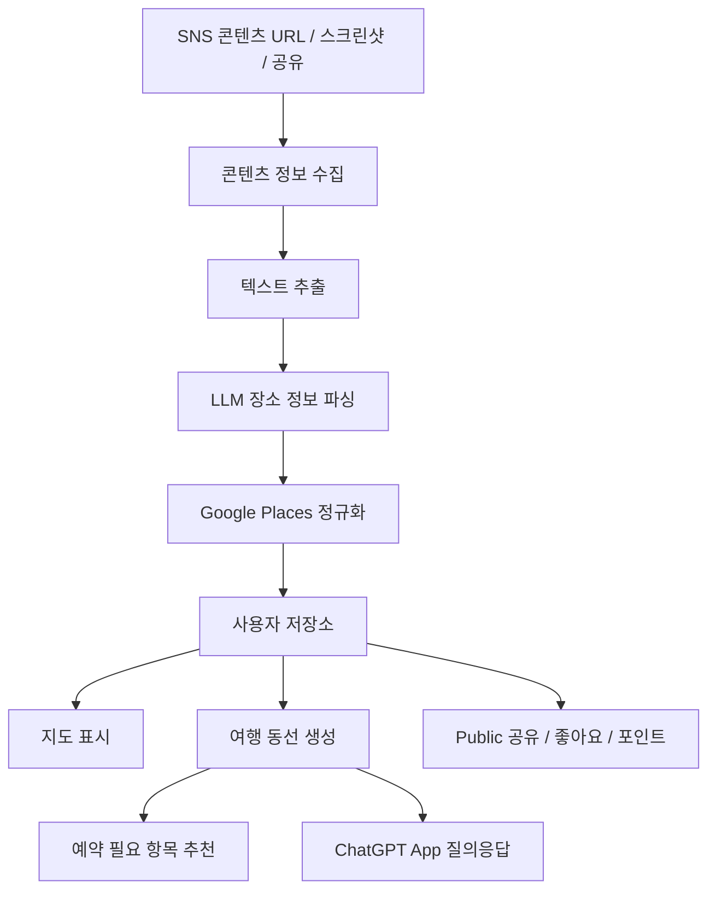

# TravelClip Planner

> 여행 릴스와 쇼츠를 저장하면, AI가 장소를 추출하고 지도에 정리한 뒤,
> 현실적인 여행 동선과 예약 추천까지 만들어주는 서비스.

---

## 1. 서비스 개요

**타깃**: 일본·동남아·유럽 자유여행을 준비하는 20~40대 Instagram/YouTube 사용자  
**핵심 가치**: SNS 여행 콘텐츠 → 실제 여행 계획 자동화

### 서비스 흐름



---

## 2. 핵심 기능

| 기능 | 설명 | 상태 |
|------|------|------|
| SNS 콘텐츠 저장 | YouTube/Instagram URL 입력 또는 스크린샷 업로드 | ✅ |
| 텍스트 추출 | 제목·설명·자막 조합으로 장소 정보 수집 | ✅ |
| 장소 파싱 | LLM으로 비정형 텍스트에서 장소 후보 추출 (confidence 포함) | ✅ |
| Google Places 정규화 | Place ID·좌표·평점·영업시간 매칭, 낮은 정확도 시 사용자 검수 | ✅ |
| 여행 동선 생성 | 저장 장소 기반 일정 자동 생성 (지역 묶음·영업시간·이동시간 고려) | ✅ |
| 항공편 연동 | 출발편·귀국편 조회 후 항공 일정을 반영해 Day 1·마지막 날 시간 제약 자동 적용 | ✅ |
| 예약 추천 | 일정에 필요한 교통권·입장권을 Klook 등 제휴 링크와 연결 | 🔲 |
| Public 공유 | 일정을 Private / Link only / Public으로 공개, 좋아요·복제 가능 | 🔲 |
| 포인트 | 좋아요(1), 저장(3), 복제(5), 예약전환(20) 적립 → 기능 unlock | 🔲 |
| 원천 표시 | 장소 카드에 출처 영상·크리에이터·추출 문장 표시 | 🔲 |
| ChatGPT App | 저장 데이터를 대화형으로 활용 (일정 생성·수정·예약 조회) | 🔲 |

---

## 3. 기술 스택

### Frontend
- Next.js, React, Tailwind CSS, shadcn/ui, Google Maps JS API

### Backend
- Next.js API Routes, Supabase (PostgreSQL), pgvector(optional), Redis(optional)

### AI / Parsing
- OpenAI API, Whisper/STT, OCR API, LLM structured output

### 지도/장소
- Google Places API, Google Maps Embed/JS API, Directions API

### 인증 / 배포
- Supabase Auth, OAuth, Google Login / Vercel, Cloudflare Workers(optional)

---

## 4. 데이터베이스 스키마

### users
| id | email | name | avatar_url | created_at |

### sources
| id | user_id | platform | url | title | creator | thumbnail_url | raw_text | status | created_at |

### extracted_places
| id | source_id | raw_name | category | city_hint | area_hint | evidence_text | confidence | status |

### places
| id | google_place_id | name | address | lat | lng | city | country | category | rating | review_count | maps_url |

### user_saved_places
| id | user_id | place_id | source_id | note | priority | created_at |

### itineraries
| id | user_id | title | city | start_date | end_date | visibility | base_location | created_at |

### itinerary_items
| id | itinerary_id | place_id | day | order_index | start_time | duration_minutes | transport_method | travel_minutes |

### booking_recommendations
| id | itinerary_id | provider | product_name | reason | booking_url | recommended_timing | affiliate_code | created_at |

### public_interactions
| id | user_id | target_type | target_id | action | created_at |

### points_ledger
| id | user_id | event_type | points | reference_id | created_at |

---

## 5. API 엔드포인트

```
POST   /api/sources                   # SNS URL 저장
GET    /api/sources/:id               # 분석 상태 조회
POST   /api/sources/:id/parse         # 텍스트 추출·장소 파싱 실행

GET    /api/places                    # 저장 장소 조회
POST   /api/places/match              # Google Places 매칭
POST   /api/places/:id/save           # 사용자 저장 추가

POST   /api/itineraries/generate      # 일정 생성
GET    /api/itineraries/:id           # 일정 조회
PATCH  /api/itineraries/:id           # 일정 수정
POST   /api/itineraries/:id/public    # 공개 전환
POST   /api/itineraries/:id/clone     # 일정 복제

GET    /api/itineraries/:id/bookings  # 예약 항목 조회
POST   /api/bookings/recommend        # 예약 상품 추천

GET    /api/public/itineraries        # 공개 일정 목록
POST   /api/public/:target_id/like    # 좋아요
POST   /api/public/:target_id/save    # 저장
```

---

## 6. ChatGPT App Tools

| Tool | 설명 |
|------|------|
| get_saved_places | 도시·카테고리 필터로 저장 장소 조회 |
| generate_itinerary | 저장 장소 기반 일정 생성 |
| revise_itinerary | 기존 일정 조건부 수정 |
| get_booking_recommendations | 일정 내 예약 필요 항목 반환 |
| search_public_itineraries | 공개 일정 검색 |

---

## 7. 주요 화면

**Web**: Home, Save Source, My Map, Itinerary Builder, Itinerary Detail, Public Explore, My Page  
**ChatGPT App**: Saved Places Preview, Itinerary Card, Booking Recommendation Card

---

## 8. MVP 단계

| 단계 | 목표 | 핵심 기능 |
|------|------|-----------|
| MVP 1 | YouTube 기반 장소 추출 | 로그인, YouTube URL 저장, LLM 파싱, Google Places 매칭, 지도 저장, 기본 일정 |
| MVP 2 | Instagram + 예약 추천 | Instagram URL, OCR/STT, 장소 검수 UI, Klook 제휴, 일정 공유 링크 |
| MVP 3 | ChatGPT App 연동 | OAuth, 저장 장소 조회, 일정 생성·수정, 예약 조회, 공개 일정 검색 |
| MVP 4 | 커뮤니티/포인트 | Public 일정, 좋아요/저장/복제, 포인트, 인기 코스 랭킹 |

---

## 9. 개발 로드맵

| 기간 | 작업 |
|------|------|
| Week 1 | 프로젝트 세팅, Supabase 스키마, 로그인, URL 저장, YouTube 메타데이터 추출 |
| Week 2 | 텍스트 추출 파이프라인, LLM 장소 추출, Google Places 매칭, 장소 저장 |
| Week 3 | 지도 UI, 장소 리스트 UI, 검수 UI, 기본 일정 생성 |
| Week 4 | 일정 상세 페이지, Google Maps 링크, 공유 링크, MVP 배포 |
| Week 5~6 | Instagram 지원, OCR/STT fallback, 예약 추천, Klook 연결 |
| Week 7~8 | ChatGPT App MCP 서버, OAuth, Tool 설계·테스트 |
| Week 9+ | Public 커뮤니티, 포인트, 추천 랭킹, 고급 동선 최적화 |

---

## 10. 수익화

Klook·Booking.com·Agoda 등 제휴 링크(예약 추천 시 노출) + Freemium(무제한 저장·고급 기능 유료) + Creator 기능(공개 코스 수익 정산).

<!-- BEGIN:nextjs-agent-rules -->
# This is NOT the Next.js you know

This version has breaking changes — APIs, conventions, and file structure may all differ from your training data. Read the relevant guide in `node_modules/next/dist/docs/` before writing any code. Heed deprecation notices.
<!-- END:nextjs-agent-rules -->


## TODO
[x] 항공편 조회해서 출/도착 시간 고려해야 함
[ ] 다른 인기 여행지 추가해야 함
[ ] 서비스 이용 방법 메인 페이지에 노출
[ ] 콘텐츠 분석해서 결과 나올 때 썸네일 이미지도 같이 보여주기
[ ] 예산 계산기 — 장소별 평균 비용(입장료·식비) 합산해 일정별 예산 견적 제공
[ ] 크리에이터 팔로우 + 알림 — 즐겨찾는 유튜버/인스타 계정 팔로우, 새 영상 올라오면 알림 → 콘텐츠 수집 자동 루프
[ ] 장소별 예약 연동 UI — needs_reservation 필드는 있으나 UI 미연결, 예약 필요 장소 강조 + 링크 연결
[ ] 여행 후기 작성 — 다녀온 일정에 사진·메모 추가 → UGC 생성 → Public 공유 활성화
[ ] 유료결제 연동
[ ] Youtube 자막 가져오는 거 찾아보기
[ ] 일정 생성 로직 검토 -> 지금 알고리즘 어떻게 되는지
